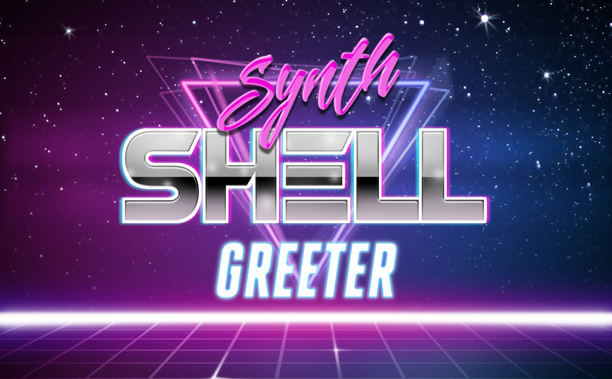
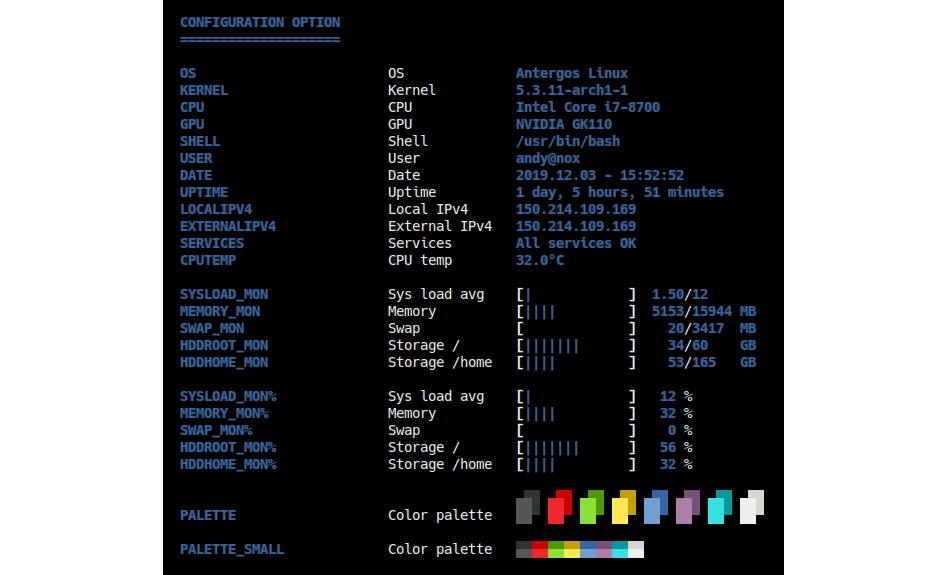

# synth-shell-greeter

[](https://github.com/andresgongora/synth-shell-greeter/releases)
[](LICENSE)
[](https://buymeacoffee.com/andresgongora)

This script is part of [synth-shell](https://github.com/andresgongora/synth-shell).

**synth-shell-greeter** shows a summary of your system's current health.

- Automatically printed in new terminal sessions (local, SSH, ...).
- Monitors your servers, RaspberryPis, and workstations. All system info you
  need at a glance (e.g. external IP address, CPU temperature, etc.).
- Detect broken services or CPU hogs.
- Print your own ASCII logo every time you log in.

<br/><br/>

<!--------------------------------------+-------------------------------------->
## Install
<!--------------------------------------+-------------------------------------->

### Arch Linux

You may install `synth-shell-greeter` from AUR:
https://aur.archlinux.org/packages/synth-shell-greeter-git/

### Manual setup

The included [setup script](setup.sh) will guide you step by step through the
installation process. Just clone this repository and run it:

```bash
git clone --recursive https://github.com/andresgongora/synth-shell-greeter.git
synth-shell-greeter/setup.sh
```

<!--------------------------------------+-------------------------------------->
## Usage
<!--------------------------------------+-------------------------------------->

You can then test your script by running it from wherever you installed it.
Usually this is to your user's `.config` folder, so you should run:

```bash
~/.config/synth-shell/synth-shell-greeter.sh
```

If you want it to appear every time you open a new terminal, run:

```bash
echo "~/.config/synth-shell/synth-shell-greeter.sh" >> ~/.bashrc
```

<!--------------------------------------+-------------------------------------->
## Configuration
<!--------------------------------------+-------------------------------------->

You can configure your scripts by modifying the corresponding configuration
files. You can find them, alongside example configuration files, in the following
folders depending on how you installed **synth-shell**:

- Current-user only: `~/.config/synth-shell/`
- System-wide: `/etc/synth-shell/`

`synth-shell-greeter` provides a summarized system report at a single glance
every time you open up a new terminal. If it detects that any system parameter
(e.g. CPU load, memory, etc.) is over a critical threshold, it will provide a
warning and additional information about the cause. Last but not least, it
prints a user-configurable ASCII logo to impress your crush from the library
with how awesome you are.

Feel free to customize your status report through the many available options
in `~/.config/synth-shell/synth-shell-greeter.config` (user-only install) or
`/etc/synth-shell/synth-shell-greeter.config` (system-wide install), or by
replacing their content with the example files you can find under the same
directory.



<!--------------------------------------+-------------------------------------->
## Contributing
<!--------------------------------------+-------------------------------------->

This project is only possible thanks to the effort and passion of many,
including developers, testers, and of course, our beloved coffee machine.
You can find a detailed list of everyone involved in the development
in [AUTHORS.md](AUTHORS.md). Thanks to all of you!

If you like this project and want to contribute, you are most welcome to do so.

### Help us improve

- [Report a bug](https://github.com/andresgongora/synth-shell/issues/new/choose):
  if you notice that something is not right, tell us. We'll try to fix it ASAP.
- Suggest an idea you would like to see in the next release: send us an email or
  open an [issue](https://github.com/andresgongora/synth-shell/issues)!
- Become a developer: fork this repo and become an active developer! Take a look
  at the [issues](https://github.com/andresgongora/synth-shell/issues) for
  suggestions of where to start. Also, take a look at our
  [coding style](doc/coding_style.md).
- Spread the word: telling your friends is the fastest way to get this code to
  the people who might enjoy it!

<!--------------------------------------+-------------------------------------->
## Donations
<!--------------------------------------+-------------------------------------->

If you like this project and want to show your support,
[buy me a coffee](https://buymeacoffee.com/andresgongora).

<!--------------------------------------+-------------------------------------->
## License
<!--------------------------------------+-------------------------------------->

Copyright (c) 2014-2026, Andres Gongora - www.andresgongora.com

- This software is released under the [GNU GPLv3](LICENSE). If the license file is
  unavailable, see <https://www.gnu.org/licenses/>.
- If you need a closed-source version of this software for commercial purposes,
  please contact the [authors](AUTHORS.md).
